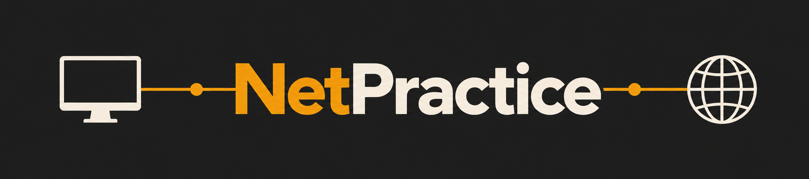

*This project has been created as part of the 42 curriculum by vslyunko.*

<p align="center">
  
</p>

<p align="center">
  
  
  
  
  
</p>

<p align="center">
  A practical introduction to IP addressing, subnetting and routing.
</p>

## DESCRIPTION

NetPractice is a networking project built around a series of simulated network exercises.

The goal is to understand how devices communicate across a network by working with IP addresses, subnet masks, gateways, routers and switches. Each level starts with a broken network configuration that needs to be analyzed and fixed, so the project is mainly about learning how the different parts of a network fit together and how to troubleshoot them.

---

## INSTRUCTIONS

### 1. Run NetPractice

Download and extract the project files, then run:

```bash
./run.sh
```

This starts a local web server and opens NetPractice in your browser.

> **Having trouble with `run.sh`?**
>
> Start the server manually:
>
> ```bash
> python3 -m http.server 49242
> ```
>
> Then open `http://localhost:49242`.

### 2. Choose how to practise

| Mode | What it does |
|------|--------------|
| **Practice** | Enter your 42 login to use your personal configuration |
| **Evaluation** | Generates a random configuration similar to an evaluation |

### 3. Solve & export

There are **10 levels**. For each one:

`Solve the network` → `Check again` → `Get my config` → `Next level`

> Export the configuration **before moving to the next level**.

### 4. Submit

You should end up with **10 configuration files** — one per level.

> **📁 Place all 10 exported files directly at the root of the repository.**

---

## RESOURCES

### Topics covered

The main networking concepts studied during this project include TCP/IP and IPv4 addressing, subnet masks and subnetting, default gateways, routers, switches, routing, and the OSI model.

### Documentation & articles

- [Cisco — IP Addressing & Subnetting](https://www.cisco.com/c/en/us/support/docs/ip/routing-information-protocol-rip/13788-3.html)
- [Cloudflare — The Network Layer](https://www.cloudflare.com/learning/network-layer/what-is-the-network-layer/)
- [Cloudflare — TCP/IP](https://www.cloudflare.com/learning/ddos/glossary/tcp-ip/)
- [Cisco — Network Switching](https://www.cisco.com/site/us/en/learn/topics/networking/what-is-network-switching.html)
- [RFC 1918 — Private IP Addressing](https://www.rfc-editor.org/info/rfc1918/)
- [RFC 4632 — CIDR](https://www.rfc-editor.org/rfc/rfc4632.html)


### Networking fundamentals

- [Networking Fundamentals — Practical Networking](https://www.youtube.com/playlist?list=PLIFyRwBY_4bRLmKfP1KnZA6rZbRHtxmXi)
  - [Network Devices: Hosts, IP Addresses, Networks — Lesson 1a](https://www.youtube.com/watch?v=bj-Yfakjllc)
  - [Network Devices: Repeaters, Hubs, Switches, Routers — Lesson 1b](https://www.youtube.com/watch?v=H7-NR3Q3BeI)
  - [OSI Model: A Practical Perspective — Lesson 2a](https://www.youtube.com/watch?v=LkolbURrtTs)

### Subnetting

- [Subnetting Mastery — Practical Networking](https://www.youtube.com/playlist?list=PLIFyRwBY_4bQUE4IB5c4VPRyDoLgOdExE)  
  Full 7-part series covering subnet masks, CIDR notation, network IDs, broadcast addresses, host ranges, and subnetting techniques.

- [Subnet Mask — Explained](https://www.youtube.com/watch?v=s_Ntt6eTn94) — PowerCert Animated Videos
- [IP Addresses Explained: Networking Basics](https://www.youtube.com/watch?v=zZ02fvBXNAI) — WhiteboardDoodles

### AI usage

AI was used to clarify networking concepts, better understand parts of the subject, and compare related topics such as IP addressing, subnetting, routing, gateways and switches.

It was also used to refine the README, make small documentation corrections, and create the project banner.